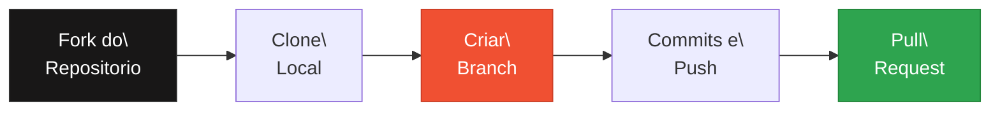

# GitHub Final Project - IBM Full Stack

<div align="center">


[](Dockerfile)

**[PT-BR](#sobre-o-projeto) | [English](#about-the-project)**

</div>

---

<a name="sobre-o-projeto"></a>

## Sobre o Projeto

> Projeto final do curso **Getting Started with Git and GitHub** -- certificacao [IBM Full Stack Software Developer](https://www.coursera.org/) no Coursera

Este repositorio demonstra o uso pratico de Git e GitHub em um fluxo de trabalho colaborativo, incluindo criacao de branches, pull requests, code of conduct e um script Bash de calculo de juros simples.

---

## Fluxo de Trabalho Git



---

## Conteudo do Repositorio

| Arquivo | Descricao |
|---|---|
| `simple-interest.sh` | Script Bash para calculo de juros simples |
| `CODE_OF_CONDUCT.md` | Codigo de conduta do projeto |
| `CONTRIBUTING.md` | Guia de contribuicao |
| `LICENSE` | Licenca MIT |

## Como Executar

```bash
git clone https://github.com/galafis/github-final-project-IBM-COURSERA-FULLSTACK.git
cd github-final-project-IBM-COURSERA-FULLSTACK
bash simple-interest.sh
```

## Aplicacao na Industria

Git e GitHub sao ferramentas fundamentais para controle de versao e colaboracao em equipes de desenvolvimento, sendo requisitos essenciais em qualquer vaga de engenharia de software.

---

<a name="about-the-project"></a>

## English

### About the Project

> Final project from the **Getting Started with Git and GitHub** course -- [IBM Full Stack Software Developer Certificate](https://www.coursera.org/) on Coursera

This repository demonstrates practical Git and GitHub usage in a collaborative workflow, including branch creation, pull requests, code of conduct, and a Bash simple interest calculator script.

### How to Run

```bash
git clone https://github.com/galafis/github-final-project-IBM-COURSERA-FULLSTACK.git
cd github-final-project-IBM-COURSERA-FULLSTACK
bash simple-interest.sh
```

---

## Licenca | License

Este projeto esta licenciado sob a [Licenca MIT](LICENSE). | This project is licensed under the [MIT License](LICENSE).

---

Developed by [Gabriel Demetrios Lafis](https://github.com/galafis)
